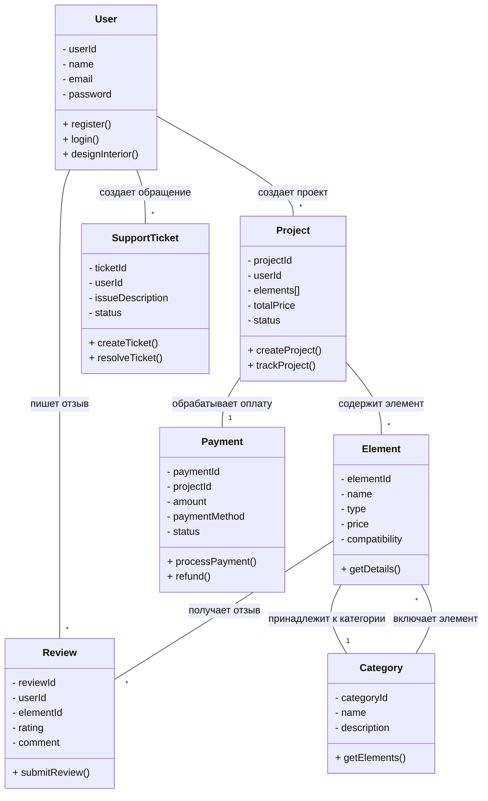
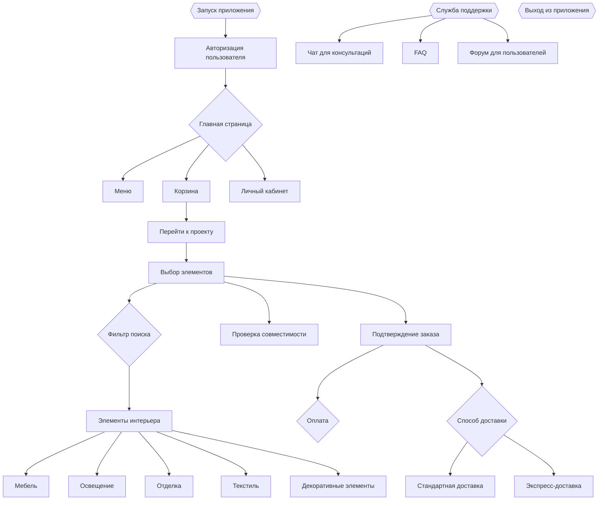
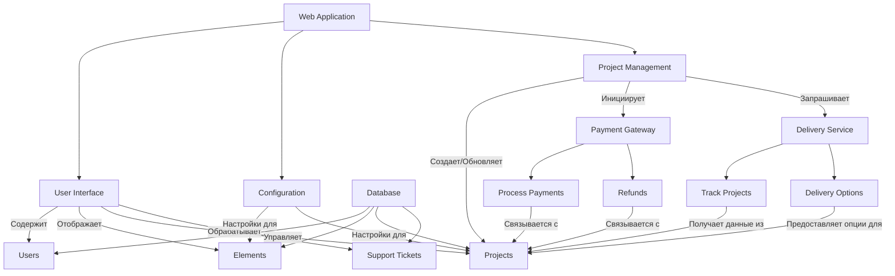

Тема: Онлайн-платформа для проектирования интерьеров  
====

Причина разработки  
----

С увеличением интереса к персонализированному дизайну интерьеров всё больше людей стремятся адаптировать свои жилые и рабочие пространства под личные предпочтения. Однако не все имеют навыки или время для самостоятельного проектирования. Проект "Онлайн-платформа для проектирования интерьеров" направлен на упрощение процесса создания уникальных интерьеров, предоставляя пользователям интуитивно понятную платформу для выбора стилей, материалов и мебели, а также возможность получения профессиональных консультаций.  
----

Требования к проекту  
1. Интерфейс платформы:  
  - Удобный и интуитивно понятный интерфейс для проектирования интерьеров.  
  - Фильтр поиска для подбора элементов декора в зависимости от бюджета и стиля.  
  - Возможность выбора различных элементов интерьера (мебель, освещение, отделка и т.д.).  
    - мебель  
       - диваны  
       - столы  
    - освещение  
        - люстры  
        - настольные лампы  
    - отделка  
    - текстиль (шторы, ковры)  
    - декоративные элементы  
  - Информация о совместимости материалов и стилей.  
  - Визуализация интерьеров в формате 3D для предварительного просмотра.  

2. База данных:  
  - Обновляемая база данных материалов и предметов интерьера с актуальными ценами и характеристиками.  
  - Возможность добавления новых товаров и удаления устаревших.  

3. Система заказов:  
  - Функционал для оформления заказа на выбранные элементы интерьера.  
  - Поддержка различных методов оплаты (карты, электронные кошельки).  

4. Служба поддержки:  
  - Чат или телефонная линия для консультаций по проектированию интерьеров.  
  - FAQ для решения распространённых вопросов.  
  - Форум для обмена идеями и решениями между пользователями.  

5. Логистика:  
  - Выбор способов доставки элементов интерьера.  
  - Налаженная система доставки и сборки мебели.  
  - Возможность отслеживания статуса заказа по номеру трекера.  

6. Безопасность:  
  - Защита пользовательских данных и информации о платежах.  
  - Соответствие стандартам безопасности и конфиденциальности.  

7. Маркетинг:  
  - Разработка стратегии продвижения проекта (социальные сети, реклама, партнерства).  
  - Создание контента для привлечения целевой аудитории (обзоры, советы по дизайну, коллаборации с известными дизайнерами).  

----

Диаграмма классов  

Демонстрация структурной системы для веб-приложения, связанного с проектированием и заказом элементов интерьера.  
- Пользователь может создавать множество проектов, заявок в поддержку и отзывов.  
- Проект может содержать множество элементов и связан с одним заказом.  
- Элемент может иметь множество отзывов и принадлежит к одной категории.  
- Категория может включать множество элементов.  

----

Диаграмма Активностей  

Описание последовательности действий пользователя в веб-приложении, включая выбор элементов интерьера, оформление заказа и доступ к службе поддержки.  

----

Диаграмма компонентов  

Здесь иллюстрируется, как различные компоненты приложения связаны друг с другом и как они обрабатывают данные пользователей и проекты.  
- UI управляет и отображает данные из базы данных.  
- Конфигурация влияет на настройки элементов и проектов.  
- Управление проектами инициирует процессы платежей и запросы к службе доставки.  
- Платежная система и служба доставки взаимодействуют с проектами для их обработки и отслеживания.  

